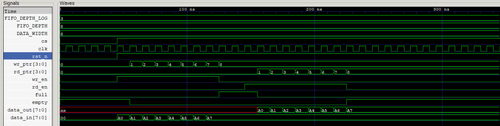

# Synchronous FIFO

This project has a simple synchronous FIFO design in SystemVerilog.

## Technical Details

- Module name: `sync_fifo`
- Parameterized FIFO depth and data width
- Active-low reset: `rst_n`
- Uses `cs` as a chip-select signal
- Write happens on the rising edge of `clk`
- Read happens on the rising edge of `clk`
- `full` and `empty` stop illegal writes and reads
- The testbench dumps a waveform file named `wave.vcd`

## What You Need

- `design.sv` - FIFO design
- `tb.sv` - testbench
- Icarus Verilog (`iverilog` and `vvp`)
- GTKWave (`gtkwave`)

## How to Run

1. Compile the code:

```bash
iverilog -g2012 -o sim design.sv tb.sv
```

2. Run the simulation:

```bash
vvp sim
```

3. Open the waveform:

```bash
gtkwave wave.vcd
```

If you change the dump file name in `tb.sv`, use that same name here.

## Waveform Image

Add your waveform image here:


